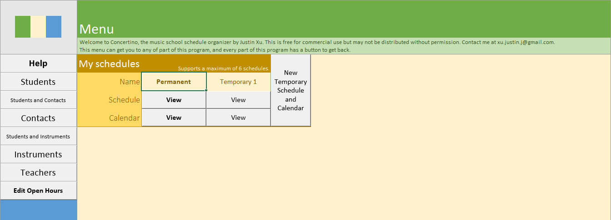

# Concertino

[Documentation](https://docs.google.com/document/d/e/2PACX-1vSxOxI5AWGej3U9z5NkT7-Sy-srvTgDEPduafk8GAeGD2WfHHm6pabB1bmBaUU59xYzlDA0ubctju7J/pub) can be found here.

This spreadsheet was created for the final project in a Gr. 11 [information technology course](https://www.ibo.org/programmes/diploma-programme/curriculum/individuals-and-societies/information-technology-in-a-global-society/). I consulted the owner of my music school as a client, and designed a scheduling tool to suit his needs. It needed to contain a database and also display the schedule in a calendar. At the time I figured that I could use VBA to set up macros and forms to emulate MS Access in Excel, where I could display the calendar on a sheet.

In hindsight, it was probably better to build Concertino in Access and use VBA to emulate Excel instead.

Included in this repository is the final version of Concertino submitted for the course. No further iteration has been made on it, except to refill personal information with garbage data.
